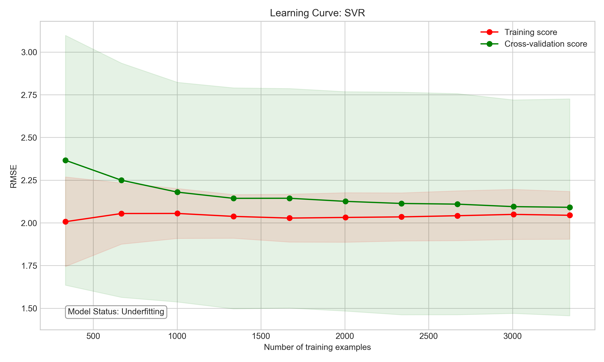
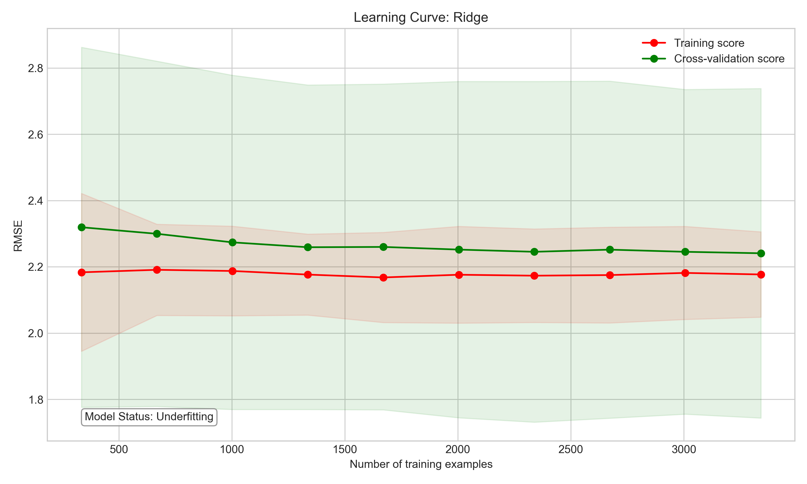

# Model Recommendation Report

**Generated on:** 2025-04-20 21:04:21

## Dataset Information
- **Dataset:** `abalone.csv`
- **Target Variable:** `Rings`

## Hyperparameter Tuning
- **Tuning Method:** Grid Search (GridSearchCV)
- **Models Tuned:** 8 out of 9

## Model Leaderboard

The following table ranks all models by their Root Mean Squared Error (RMSE):

| Model            |   RMSE |    MAE |     R² |   Training Time (s) | Tuned   | Best Parameters                                                                |
|:-----------------|-------:|-------:|-------:|--------------------:|:--------|:-------------------------------------------------------------------------------|
| SVR              | 2.1754 | 1.4892 | 0.5628 |              5.1387 | Yes     | {'C': 10.0, 'epsilon': 0.2, 'kernel': 'rbf'}                                   |
| Ridge            | 2.2116 | 1.5939 | 0.5482 |              0.0364 | Yes     | {'alpha': 1.0, 'solver': 'svd'}                                                |
| LinearRegression | 2.2116 | 1.5931 | 0.5482 |              0.0008 | No      | nan                                                                            |
| ElasticNet       | 2.2118 | 1.5939 | 0.5481 |              0.1322 | Yes     | {'alpha': 0.001, 'l1_ratio': 0.9}                                              |
| Lasso            | 2.2118 | 1.5938 | 0.5481 |              0.0902 | Yes     | {'alpha': 0.001, 'selection': 'random'}                                        |
| KNN              | 2.2125 | 1.5122 | 0.5478 |              0.1560 | Yes     | {'n_neighbors': 11, 'p': 1, 'weights': 'distance'}                             |
| RandomForest     | 2.2181 | 1.5503 | 0.5455 |             20.0591 | Yes     | {'max_depth': 10, 'min_samples_split': 10, 'n_estimators': 200}                |
| GradientBoosting | 2.2465 | 1.5716 | 0.5338 |             26.6019 | Yes     | {'learning_rate': 0.05, 'max_depth': 3, 'n_estimators': 200, 'subsample': 0.9} |
| DecisionTree     | 2.3164 | 1.6258 | 0.5043 |              2.3494 | Yes     | {'max_depth': 5, 'min_samples_leaf': 1, 'min_samples_split': 10}               |

## Recommended Model

Based on the performance metrics, the **SVR** model is recommended for this dataset.

### Performance Metrics
- **RMSE:** 2.1754
- **MAE:** 1.4892
- **R²:** 0.5628

### Best Hyperparameters
```
{'C': 10.0, 'epsilon': 0.2, 'kernel': 'rbf'}
```

### Justification

The SVR model achieved the lowest RMSE of 2.1754, indicating it has the best predictive accuracy among all models tested. 

The R² value of 0.5628 indicates that the model explains approximately 56.3% of the variance in the target variable.

### Model Characteristics

Support Vector Regressor uses kernel functions to map data to a higher-dimensional space where a linear relationship can be found. It's effective for non-linear relationships but can be slow on large datasets.

## Learning Curve Analysis

Learning curves help visualize how model performance evolves with increasing training data size, allowing us to detect underfitting, overfitting, and variance issues.


### SVR Learning Curve



**Model Status:** Underfitting


This model is **underfitting** the data, which means it's too simple to capture the underlying patterns. Consider:
- Using a more complex model
- Adding more features
- Reducing regularization strength

### Ridge Learning Curve



**Model Status:** Underfitting


This model is **underfitting** the data, which means it's too simple to capture the underlying patterns. Consider:
- Using a more complex model
- Adding more features
- Reducing regularization strength

## Visualization Links

Additional visualizations for all models can be found in the `reports/visuals/` directory.

## Next Steps

1. Consider further hyperparameter tuning to improve the SVR model
2. Evaluate the model on new data to ensure generalizability
3. Consider feature engineering to potentially improve performance
4. For production deployment, retrain the model on the full dataset
